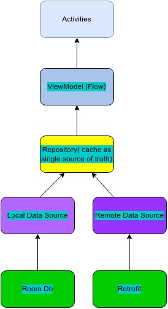

# Neversitup code test
## App Architecture

### The app is implemmented using MVVM and clean architecture best practices using the following libraries
- Room - part of android jetpack released by google for persisting data locally
- Retrofit - well known and widely used third party library for integrating with APIs
- Coroutine - library for structured concurrency recommended by google for asynchronous programming
- Moshi - a modern JSON parser library
- Hilt - a library by google for dependency injection
